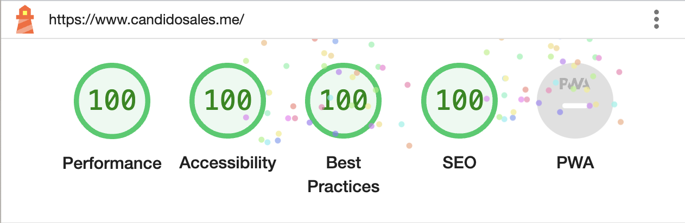

# Personal Blog 2v - Astro + Tailwind + Svelte

Inspirations:

- https://www.rachelhow.com/
- https://paco.me/
- https://swissfolio.vercel.app/
  - https://twitter.com/mike_andreuzza/status/1665265318359449601
- https://runway.com/
- https://zenorocha.com/
- https://twitter.com/ilyamiskov/status/1662168020410564623
- https://rauno.me/

## 🎯 Features

- ✅ [Tailwind](https://tailwindcss.com/);
- ✅ [Astro 5v](https://astro.build/);
- ✅ [Astro/Sitemap](https://docs.astro.build/en/guides/integrations-guide/sitemap/);
- ✅ [Astro/compress](https://github.com/astro-community/astro-compress);
- ✅ [Astro/SEO](https://github.com/onwidget/astrolib/tree/main/packages/seo);
- ✅ [Astro/Partytown](https://docs.astro.build/en/guides/integrations-guide/partytown/);
- ✅ [Svelte 5](https://svelte.dev/);
- ✅ [i18n](https://docs.astro.build/en/guides/internationalization/);
- ✅ [Performance Optimization Strategy](https://paper.dropbox.com/doc/Performance-Optimization-Strategy-in-2023--B5jjdEwca8NURASq1CAAnSQVAg-qWcr7orx2cEWHpLqoLeTC)
- ✅ [Fontsource](https://docs.astro.build/en/guides/fonts/)
- ✅ [Open Graph Image with Satori](https://github.com/vercel/satori)

## 🧞 Commands

All commands are run from the root of the project, from a terminal:

| Command                   | Action                                           |
| :------------------------ | :----------------------------------------------- |
| `npm install`             | Installs dependencies                            |
| `npm run dev`             | Starts local dev server at `localhost:3000`      |
| `npm run build`           | Build your production site to `./dist/`          |
| `npm run preview`         | Preview your build locally, before deploying     |
| `npm run astro ...`       | Run CLI commands like `astro add`, `astro check` |
| `npm run astro -- --help` | Get help using the Astro CLI                     |
| `npx @astrojs/upgrade`    | Astro upgrade                                    |

## 👍 Contribute

If you want to say thank you and/or support the active development this project:

1. Add a [GitHub Star](https://github.com/candidosales/personal-blog-2v/stargazers) to the project.
2. Write a review or tutorial on [Medium](https://medium.com/), [Dev.to](https://dev.to/) or personal blog.
3. Support the project by donating a [cup of coffee](https://buymeacoff.ee/candidosales).

## ☕ Supporters

If you want to support Personal Portfolio, you can ☕ [**buy a coffee here**](https://buymeacoff.ee/candidosales)

## ✨ Acknowledgment

## Author

- Cândido Sales - [@candidosales](https://twitter.com/candidosales)

## ⚠️ Copyright and license

Code and documentation copyright 2020-2030 the [Authors](https://github.com/candidosales/personal-blog-2v/graphs/contributors) and Code released under the [MIT License](https://github.com/candidosales/personal-blog-2v/blob/master/LICENSE). Docs released under [Creative Commons](https://creativecommons.org/licenses/by/3.0/).
