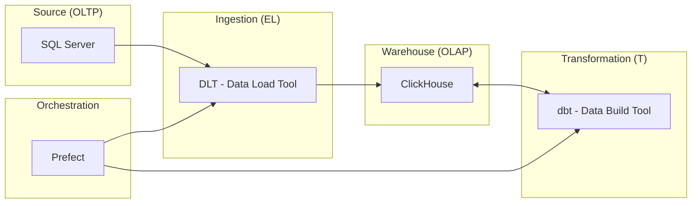

Ultimamente venho estudando sobre Data Engineering e Data Pipelines. Achei interessante compartilhar um pouco do que ando aprendendo.

Onde quis fazer uma prova de conceito de uma pipeline de dados simples, mas que pudesse ser facilmente replicada em qualquer ambiente usando Docker, onde pudesse subir todo o ambiente usando Docker compose e que trouxesse conceitos de engenheria de software usando Dbt.

Para tornar um pouco mais desafiador, quis fazer a ingestão de dados de banco MS SQL Server, que é um banco de dados que não costumo trabalhar no dia a dia, e o dataset seria sobre o táxi de Nova York, que é um dataset público e bem conhecido na comunidade de dados.

A arquitetura da solução ficou assim:



## Criar o ambiente com Docker Compose

Primeiro passo é criar o ambiente com Docker Compose, onde vou subir o banco de dados de origem. Criei o arquivo `docker-compose.yml` na pasta raiz do seu projeto com o seguinte conteúdo:

```yaml
services:
  sqlserver:
    image: mcr.microsoft.com/mssql/server:2022-latest
    container_name: sqlserver
    environment:
      ACCEPT_EULA: 'Y'
      MSSQL_SA_PASSWORD: 'YourStrong!Passw0rd'
    ports:
      - '1433:1433'
    volumes:
      - sqlserverdata:/var/opt/mssql
```

Em seguida inicializo o container:

```bash
docker-compose up -d
```

### Importar os dados no SQL Server

Fiz o download dos dados do [NYC Taxi & Limousine Commission (TLC) Trip Record Data](https://www1.nyc.gov/site/tlc/about/tlc-trip-record-data.page) através desse [link](https://aka.ms/sqlmldocument/NYCTaxi_Sample.bak), e salvei o arquivo na pasta `dataset` do meu projeto.


Para importar o arquivo de backup `.bak` para dentro do container do SQL Server, uso o seguinte comando:

```bash
docker cp ./dataset/NYCTaxi_Sample.bak sqlserver:/var/opt/mssql/data/NYCTaxi_Sample.bak
```

Em seguida, executo o comando de restauração do banco de dados:
```bash
docker exec -it sqlserver /opt/mssql-tools18/bin/sqlcmd \
   -S localhost -U sa -P 'YourStrong!Passw0rd' -C \
   -Q 'RESTORE DATABASE NYCTaxi_Sample FROM DISK = "/var/opt/mssql/data/NYCTaxi_Sample.bak" WITH MOVE "NYCTaxi_Sample" TO "/var/opt/mssql/data/NYCTaxi_Sample.mdf", MOVE "NYCTaxi_Sample_log" TO "/var/opt/mssql/data/NYCTaxi_Sample_log.ldf"'
```

## Referências:

- https://learn.microsoft.com/en-us/sql/machine-learning/tutorials/demo-data-nyctaxi-in-sql?view=sql-server-ver17 