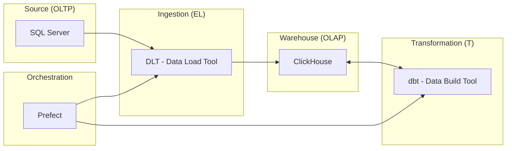
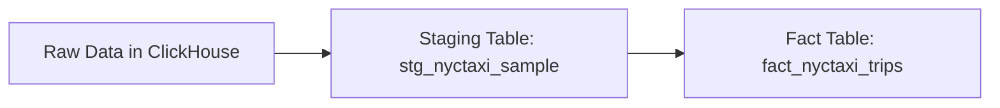

Ultimamente venho estudando sobre Data Engineering e Data Pipelines. Achei interessante compartilhar um pouco do que ando aprendendo.

Onde quis fazer uma prova de conceito de uma pipeline de dados simples, mas que pudesse ser facilmente replicada em qualquer ambiente usando Docker, onde pudesse subir todo o ambiente usando Docker compose e que trouxesse conceitos de engenheria de software usando Dbt.

Para tornar um pouco mais desafiador, quis fazer a ingestão de dados de banco MS SQL Server, que é um banco de dados que não costumo trabalhar no dia a dia, e o dataset seria sobre o táxi de Nova York, que é um dataset público e bem conhecido na comunidade de dados.

A arquitetura da solução ficou assim:



## Criar o ambiente com Docker Compose

Primeiro passo é criar o ambiente com Docker Compose, onde vou subir o banco de dados de origem. Criei o arquivo `docker-compose.yml` na pasta raiz do seu projeto com o seguinte conteúdo:

```yaml
services:
  sqlserver:
    image: mcr.microsoft.com/mssql/server:2022-latest
    container_name: sqlserver
    environment:
      ACCEPT_EULA: 'Y'
      MSSQL_SA_PASSWORD: 'YourStrong!Passw0rd'
    ports:
      - '1433:1433'
    volumes:
      - sqlserverdata:/var/opt/mssql
```

Em seguida inicializo o container:

```bash
docker-compose up -d
```

### Importar os dados no SQL Server

Fiz o download dos dados do [NYC Taxi & Limousine Commission (TLC) Trip Record Data](https://www1.nyc.gov/site/tlc/about/tlc-trip-record-data.page) através desse [link](https://aka.ms/sqlmldocument/NYCTaxi_Sample.bak), e salvei o arquivo na pasta `dataset` do meu projeto.


Para importar o arquivo de backup `.bak` para dentro do container do SQL Server, uso o seguinte comando:

```bash
docker cp ./dataset/NYCTaxi_Sample.bak sqlserver:/var/opt/mssql/data/NYCTaxi_Sample.bak
```

Em seguida, executo o comando de restauração do banco de dados:
```bash
docker exec -it sqlserver /opt/mssql-tools18/bin/sqlcmd \
   -S localhost -U sa -P 'YourStrong!Passw0rd' -C \
   -Q 'RESTORE DATABASE NYCTaxi_Sample FROM DISK = "/var/opt/mssql/data/NYCTaxi_Sample.bak" WITH MOVE "NYCTaxi_Sample" TO "/var/opt/mssql/data/NYCTaxi_Sample.mdf", MOVE "NYCTaxi_Sample_log" TO "/var/opt/mssql/data/NYCTaxi_Sample_log.ldf"'
```

### Criar estrutura do projeto

Agora que o banco de dados está pronto, vou criar a estrutura do projeto com as ferramentas que vou utilizar: DLT, ClickHouse, Dbt e Prefect.

Primeiro organizo a estrutura de pastas do projeto:

```bash
data-engineer/
├── dataset/            # Raw data backups
├── nyc_taxi/
│   ├── main_flow.py    # Prefect orchestrator
│   ├── extract_sqlserver.py  # DLT ingestion logic
│   └── nyc_taxi_dbt/   # dbt project
│       ├── models/     # SQL Transformation models
│       └── profiles.yml # dbt connection settings
└── docker-compose.yaml # Infrastructure definition
```

Dentro da pasta `nyc_taxi`, crio o ambiente virtual do Python e instalo as dependências necessárias usando [UV](https://docs.astral.sh/uv/). O UV é uma ferramenta de gerenciamento de dependências e ambientes virtuais para projetos Python construída em Rust (recomendo você conhecer).

```bash
brew install uv
```

Em seguida, inicializo o ambiente UV:

```bash
uv init nyc_taxi
```

Adiciono as dependências do projeto:

```bash
uv add dbt-core dbt-sqlserver dbt-clickhouse prefect prefect-client
```

Em seguida, criar o projeto Dbt:

### Configurar o Dbt

O Dbt (Data Build Tool) é uma ferramenta de transformação de dados que permite aos engenheiros de dados e analistas transformar, testar e documentar dados em seus armazéns de dados. Para criar o projeto Dbt, navego até a pasta `nyc_taxi` e executo o comando:

```bash
cd nyc_taxi
dbt init nyc_taxi_dbt
```

Meu arquivo `dbt_project.yml` ficou assim:

```yaml
# Name your project! Project names should contain only lowercase characters
# and underscores. A good package name should reflect your organization's
# name or the intended use of these models
name: 'nyc_taxi_dbt'
version: '1.0.0'

# This setting configures which "profile" dbt uses for this project.
profile: 'nyc_taxi_clickhouse'

# These configurations specify where dbt should look for different types of files.
# The `model-paths` config, for example, states that models in this project can be
# found in the "models/" directory. You probably won't need to change these!
model-paths: ['models']
analysis-paths: ['analyses']
test-paths: ['tests']
seed-paths: ['seeds']
macro-paths: ['macros']
snapshot-paths: ['snapshots']

clean-targets: # directories to be removed by `dbt clean`
  - 'target'
  - 'dbt_packages'

# Configuring models
# Full documentation: https://docs.getdbt.com/docs/configuring-models

# In this example config, we tell dbt to build all models in the example/
# directory as views. These settings can be overridden in the individual model
# files using the `{{ config(...) }}` macro.
models:
  nyc_taxi_dbt:
    # Config indicated by + and applies to all files under models/example/
    example:
      +materialized: view
```

Configuro o arquivo `~/.dbt/profiles.yml` para conectar no ClickHouse:

```yaml
nyc_taxi_clickhouse:
  target: dev
  outputs:
    dev:
      type: clickhouse
      host: localhost
      port: 8123
      user: default
      password: password
      schema: nyc_taxi
      threads: 4
```

Vou pode testar se o projeto Dbt está funcionando corretamente executando o comando:

```bash
uv run dbt debug
```

### Configurar os Dbt models

Vou criar os modelos Dbt para transformar os dados. Crio as pastas e arquivos necessários dentro da pasta `nyc_taxi/nyc_taxi_dbt/models/`:

- staging/
  - sources.yml
  - stg_nyctaxi_sample.sql
- marts/
  - fact_nyctaxi_trips.sql

O arquivo `sources.yml` define a fonte de dados:

```yaml
version: 2

sources:
  - name: clickhouse_staging
    database: nyc_taxi
    tables:
      - name: nyctaxi_sample
        identifier: nyc_taxi_staging___nyctaxi_sample
```

O arquivo `stg_nyctaxi_sample.sql` cria a tabela de staging:

```sql
{{ config(materialized='view') }}

with source as (
    select * from {{ source('clickhouse_staging', 'nyctaxi_sample') }}
),

renamed as (
    select
        medallion,
        hack_license,
        vendor_id,
        rate_code,
        store_and_fwd_flag,
        pickup_datetime,
        dropoff_datetime,
        passenger_count,
        trip_time_in_secs,
        trip_distance,
        pickup_longitude,
        pickup_latitude,
        dropoff_longitude,
        dropoff_latitude,
        payment_type,
        fare_amount,
        surcharge,
        mta_tax,
        tolls_amount,
        total_amount,
        tip_amount,
        tipped,
        tip_class,
        _dlt_load_id,
        _dlt_id
    from source
)

select * from renamed
```

O arquivo `fact_nyctaxi_trips.sql` cria a tabela fato:

```sql
{{ config(
    materialized='incremental',
    engine='ReplacingMergeTree',
    order_by=['medallion', 'hack_license', 'pickup_datetime'],
    unique_key='_dlt_id',
    incremental_strategy='append'
) }}

-- ReplacingMergeTree handles duplicates automatically based on the ORDER BY keys
-- when merges happen. In dbt-clickhouse, 'incremental' with 'append' is often used
-- with ReplacingMergeTree to let the engine handle deduplication.

with staging as (
    select * from {{ ref('stg_nyctaxi_sample') }}
    
    where pickup_datetime > (select max(pickup_datetime) from {{ this }})
    
)

select * from staging
```

A razão de usar o `ReplacingMergeTree` é que ele permite que o ClickHouse gerencie automaticamente a substituição de registros duplicados com base na chave primária definida (neste caso, `medallion`, `hack_license` e `pickup_datetime`). Isso é especialmente útil para cenários de carga incremental, onde novos dados podem conter atualizações ou correções para registros existentes.

Além disso dividi em staging e marts para seguir as boas práticas de organização de projetos Dbt, onde os dados brutos são primeiro carregados em tabelas de staging antes de serem transformados em tabelas fato ou dimensão.

Então, ilustrando o fluxo de dados, seria:



### Configurar o Docker Compose para ClickHouse e Prefect

Agora vou adicionar os serviços do ClickHouse e do Prefect no arquivo `docker-compose.yml`:

```yaml
services:
  sqlserver: # Abaixo o serviço do SQL Server já criado
  clickhouse:
    image: clickhouse/clickhouse-server
    container_name: clickhouse
    environment:
      CLICKHOUSE_USER: default
      CLICKHOUSE_PASSWORD: password
      CLICKHOUSE_DB: nyc_taxi
      CLICKHOUSE_DEFAULT_ACCESS_MANAGEMENT: 1
    ports:
      - '8123:8123'
      - '9000:9000'
    volumes:
      - clickhousedata:/var/lib/clickhouse
  prefect:
    image: prefecthq/prefect:3-python3.12
    container_name: prefect
    environment:
      PREFECT_SERVER_API_HOST: 0.0.0.0
    command: prefect server start --no-services
    ports:
      - '4200:4200'
    volumes:
      - prefectdata:/var/lib/prefect
volumes:
  sqlserverdata:
  clickhousedata:
  prefectdata:
```

### Criar o fluxo de orquestração com Prefect

Agora vou criar o fluxo de orquestração usando o Prefect. Crio o arquivo `main_flow.py` dentro da pasta `nyc_taxi` com o seguinte conteúdo:

```python
import logging
from prefect import flow, task
from extract_sqlserver import load_sql_server_to_clickhouse
from prefect_dbt import PrefectDbtRunner, PrefectDbtSettings

# Configure logging
logging.basicConfig(level=logging.INFO)
logger = logging.getLogger(__name__)

@task(retries=3, retry_delay_seconds=60)
def extract_task():
    logger.info("Starting extraction task...")
    load_sql_server_to_clickhouse()
    logger.info("Extraction task completed.")

@task
def dbt_run_task():
    logger.info("Starting dbt run task...")
    result = PrefectDbtRunner(
        settings=PrefectDbtSettings(
            project_dir="nyc_taxi_dbt",
            profiles_dir="nyc_taxi_dbt"
        )
    ).invoke(["build"])
    logger.info("dbt run task completed.")

@task
def data_quality_checks():
    logger.info("Running data quality checks...")
    # This could be more dbt tests or custom SQL checks
    # For now, we'll assume dbt build (which includes tests) covers this.
    logger.info("Data quality checks passed.")

@flow(name="nyc_taxi_etl")
def nyc_taxi_pipeline():
    extract_task()
    dbt_run_task()
    data_quality_checks()
    # Alerting can be handled by Prefect's native automation or state handlers
    logger.info("Pipeline completed successfully.")

if __name__ == "__main__":
    nyc_taxi_pipeline.serve(name="nyc_taxi_pipeline", cron="0 */12 * * *")

```

Em seguida, crio o arquivo `extract_sqlserver.py` com a lógica de extração dos dados do SQL Server para o ClickHouse:

```python

import logging
import dlt
from dlt.sources.sql_database import sql_database

def load_sql_server_to_clickhouse():
    # Configure logging to see what's happening
    logging.basicConfig(level=logging.INFO, format='%(asctime)s - %(levelname)s - %(message)s')
    logger = logging.getLogger(__name__)
    
    logger.info("Starting SQL Server to ClickHouse extraction...")
    # Configure the destination: ClickHouse
    # dlt will automatically pick up credentials from .dlt/secrets.toml
    pipeline = dlt.pipeline(
        pipeline_name="sql_server_to_clickhouse",
        destination="clickhouse"
    )
    
    # Define the source with incremental logic
    # dlt will automatically pick up credentials for sql_database from .dlt/secrets.toml
    source = sql_database().with_resources("nyctaxi_sample")
    
    # Configure incremental loading and primary keys for the resource
    # To use ReplacingMergeTree in ClickHouse, we need a primary key.
    # medallion + hack_license + pickup_datetime seem like a good candidate for a unique key in this sample.
    source.nyctaxi_sample.apply_hints(
        incremental=dlt.sources.incremental("pickup_datetime"),
        primary_key=["medallion", "hack_license", "pickup_datetime"]
    )
    
    # Run the pipeline
    # Use 'merge' to support updates/CDC and trigger ReplacingMergeTree.
    info = pipeline.run(source, write_disposition="merge")
    
    print(info)

if __name__ == "__main__":
    load_sql_server_to_clickhouse()
```

## Referências:

- https://learn.microsoft.com/en-us/sql/machine-learning/tutorials/demo-data-nyctaxi-in-sql?view=sql-server-ver17 